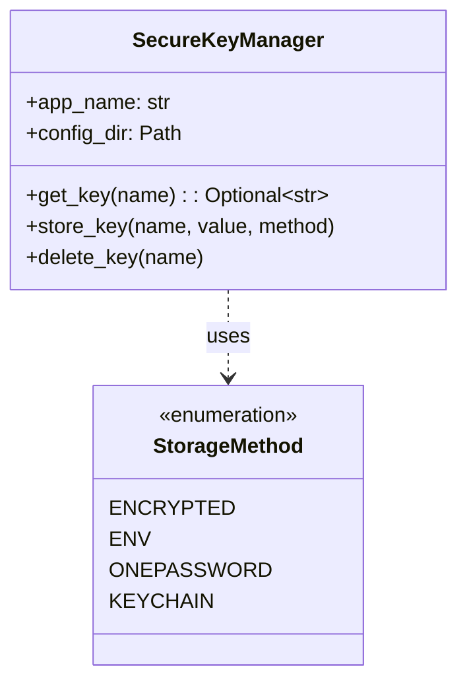

# Module: Core Utilities

## 1. Overview

The Core Utilities module groups **standalone helpers** used across the project: **files** (paths, filtering, temp dirs), **timedate** (datetime/timestamp formatting), **string** (IDs, memory formatting, capitalization, date parsing), **secrets** (secure key storage and retrieval), and **network** (IP/subnet validation and generation). There is no shared state; each unit is a set of functions or a small class with minimal dependencies.

**Roles:**

- **files:** Recursive file listing, filter by name (fuzz or exact), list subdirectories, temp folder creation.
- **timedate:** Convert datetime or Unix timestamp to string (ISO 8601 or custom format); current time string.
- **string:** Zettelkasten-style ID, UUID hex, human-readable memory size, capitalize words, parse date strings to dict.
- **secrets:** SecureKeyManager — encrypted/env/1Password/keychain storage for API keys; get/store/delete by key name.
- **network:** IP-in-subnet check, IP+netmask validation, generate IP from subnet and index.

---

## 2. Basics

### Terminology

| Term | Meaning |
|------|--------|
| **get_file_paths(directory)** | Recursively list all file paths under a directory. |
| **filter_files(part_file_name, directory, fuzz)** | Paths whose basename contains (fuzz=True) or equals (fuzz=False) the given string. |
| **datetime_converter / timestamp_converter** | datetime or Unix timestamp → formatted string (ISO8601 or strftime). |
| **zettelkasten_id()** | UUID-derived ID like `"{first9}.{last11}"` hex. |
| **SecureKeyManager** | App-scoped key storage; supports encrypted file, env var, 1Password, keychain. |
| **StorageMethod** | Enum: ENCRYPTED, ENV, ONEPASSWORD, KEYCHAIN. |
| **verify_ip_in_subnet(ip, subnet)** | True if IP is in the given CIDR subnet. |

### Entry points

- **Files:** `ures.files.get_file_paths`, `filter_files`, `list_directories`, `get_temp_folder`, `get_temp_dir_with_specific_path`.
- **Timedate:** `ures.timedate.datetime_converter`, `timestamp_converter`, `time_now`.
- **String:** `ures.string.zettelkasten_id`, `unique_id`, `format_memory`, `capitalize_string`, `string2date`.
- **Secrets:** `ures.secrets.SecureKeyManager`, `StorageMethod`; init with app_name and optional config_dir, then `get_key(name)`, `store_key(name, value, method)`.
- **Network:** `ures.network.verify_ip_in_subnet`, `is_valid_ip_netmask`, `generate_ip`.

---

## 3. Architecture & Logic

- **Core logic:**
  - **files:** `os.walk` for recursion; filtering via `os.path.basename` and `in` or `==`. Temp: `tempfile.TemporaryDirectory().name` or `tempfile.gettempdir()` + joined path + `os.makedirs`.
  - **timedate:** `datetime.isoformat() + "Z"` or `strftime(format)`; `time_now` uses UTC and delegates to `datetime_converter`.
  - **string:** UUID via `uuid.uuid4().hex`; memory uses KB/MB/GB thresholds; `string2date` tries `%Y-%m-%d`, `%Y-%m`, then year-only int.
  - **secrets:** Encryption key in config dir; keys stored in JSON (encrypted) or env/1Password/keychain per StorageMethod. Optional 1Password SDK.
  - **network:** `ipaddress.ip_address`, `ip_network` for validation and containment; `generate_ip` = network_address + last_index.
- **Dependencies:** Standard library (os, tempfile, datetime, uuid, re, ipaddress); secrets uses pathlib, logging, optional 1Password; string uses datetime for string2date.

---

## 4. UML & Structure

### Component overview (no single class hierarchy)



- **files, timedate, string, network:** Pure functions; no class diagram needed for the main API.

---

## 5. Code-Level Understanding

### Files

- **get_file_paths:** One pass `os.walk`; appends `os.path.join(root, file)` for each file. Returns list of str paths.
- **filter_files:** Calls `get_file_paths(directory)` then filters: `part_file_name in os.path.basename(path)` (fuzz) or `part_file_name == os.path.basename(path)` (exact).
- **list_directories(path):** Returns None if path does not exist (logs warning); else list of entry names where `os.path.isdir(os.path.join(path, entry))`.
- **get_temp_folder:** Returns `tempfile.TemporaryDirectory().name` (note: directory may be deleted when the TemporaryDirectory is GC’d).
- **get_temp_dir_with_specific_path(*args):** Path = `tempfile.gettempdir() / *args`; `os.makedirs(..., exist_ok=True)`; returns path.

### Timedate

- **datetime_converter(time, iso8601, format):** If iso8601 → `time.isoformat() + "Z"`; else `time.strftime(format)`.
- **timestamp_converter(timestamp, ...):** `datetime.datetime.fromtimestamp(timestamp)` then `datetime_converter`.
- **time_now:** Uses `datetime.datetime.now(datetime.UTC)` (or timezone.utc on 3.10) then `datetime_converter`.

### String

- **string2date(date_string):** Tries in order: `%Y-%m-%d` → dict with year, month (3-letter), day; `%Y-%m` → day None; year-only (4-digit int) → month and day None. Returns `{"year", "month", "day"}` with None for missing.

### Secrets

- **SecureKeyManager:** Config dir under home (platform-specific); `.encryption_key` for symmetric key; `encrypted_keys.json` for encrypted payloads. `get_key`/`store_key`/`delete_key` dispatch by StorageMethod. 1Password requires optional dependency.

### Network

- **verify_ip_in_subnet:** `ipaddress.ip_address(ip)` and `ip_network(subnet)`; returns `ip_obj in network_obj`.
- **is_valid_ip_netmask:** Validates IP; if netmask is digits, checks prefix length (32/128); else tries `ip_network(f"{ip}/{netmask}", strict=False)`.
- **generate_ip(subnet, last_index):** `network_address + last_index`, return str.

---

## 6. Usage & Examples

### Integration

```python
from ures.files import get_file_paths, filter_files, get_temp_dir_with_specific_path
from ures.timedate import time_now, timestamp_converter
from ures.string import zettelkasten_id, format_memory, string2date
from ures.secrets import SecureKeyManager, StorageMethod
from ures.network import verify_ip_in_subnet, generate_ip
```

### Snippets

```python
# Files
paths = get_file_paths("/tmp/project")
matches = filter_files("readme", "/tmp", fuzz=True)
temp = get_temp_dir_with_specific_path("myapp", "cache")

# Timedate
now = time_now(iso8601=True)
s = timestamp_converter(1577880000, iso8601=False, format="%d/%m/%Y")

# String
zk_id = zettelkasten_id()
mem_str = format_memory(1024 * 1024)  # "1.00 MB"
d = string2date("2024-01-15")  # {"year": 2024, "month": "Jan", "day": 15}

# Secrets
mgr = SecureKeyManager("myapp")
mgr.store_key("api_key", "secret", StorageMethod.ENCRYPTED)
value = mgr.get_key("api_key")

# Network
ok = verify_ip_in_subnet("192.168.1.10", "192.168.1.0/24")
ip = generate_ip("192.168.0.0/24", 100)  # "192.168.0.100"
```

---

## 7. Public API / Interfaces

### Files

| Function | Description |
|----------|-------------|
| `get_file_paths(directory)` | List all file paths under directory (recursive). |
| `filter_files(part_file_name, directory, fuzz=True)` | Paths matching name (substring or exact). |
| `list_directories(path)` | Subdirectory names, or None if path missing. |
| `get_temp_folder()` | Path of a new temp directory (TemporaryDirectory). |
| `get_temp_dir_with_specific_path(*args)` | Temp dir with given path components; creates if needed. |

### Timedate

| Function | Description |
|----------|-------------|
| `datetime_converter(time, iso8601=True, format="%Y%m%d-%H%M%S")` | datetime → string. |
| `timestamp_converter(timestamp, iso8601=True, format=...)` | Unix timestamp → string. |
| `time_now(iso8601=True, format=...)` | Current time as string (UTC). |

### String

| Function | Description |
|----------|-------------|
| `zettelkasten_id()` | UUID-based ID string (9.11 hex). |
| `unique_id()` | 32-char hex. |
| `format_memory(nbytes)` | Human-readable size (B/KB/MB/GB). |
| `capitalize_string(string, separator=" ")` | Capitalize each word. |
| `string2date(date_string)` | Parse to `{year, month, day}` dict. |

### Secrets

| Symbol | Description |
|--------|-------------|
| `SecureKeyManager(app_name, config_dir=None)` | Key manager; config dir under home if not given. |
| `StorageMethod` | Enum: ENCRYPTED, ENV, ONEPASSWORD, KEYCHAIN. |
| `get_key(name)` | Retrieve value or None. |
| `store_key(name, value, method)` | Store under name with given method. |
| `delete_key(name)` | Remove key. |

### Network

| Function | Description |
|----------|-------------|
| `verify_ip_in_subnet(ip, subnet)` | True if IP in CIDR subnet. |
| `is_valid_ip_netmask(ip, netmask)` | True if valid IP and netmask (CIDR or dotted). |
| `generate_ip(subnet, last_index)` | network_address + last_index as str. |

---

## 8. Maintenance & Troubleshooting

- **get_temp_folder:** Returning `.name` of a TemporaryDirectory can leave the dir to be cleaned up by GC; prefer `get_temp_dir_with_specific_path` for longer-lived temp dirs.
- **time_now:** Python 3.10 uses `datetime.timezone.utc`; 3.11+ uses `datetime.UTC`.
- **SecureKeyManager:** 1Password requires `onepassword` package; keychain/platform-specific. Encrypted keys are stored in config dir — protect permissions.
- **string2date:** Only supports the documented formats; invalid input returns all None.
- **network:** `generate_ip` does not check bounds; large last_index can overflow.

---

## 9. Execution Protocol

1. **Map logic:** `ures/files.py`, `ures/timedate.py`, `ures/string.py`, `ures/secrets.py`, `ures/network.py`.
2. **Abstract:** Document purpose and behavior; do not duplicate line-by-line code.
3. **Draft:** Follow this template.
4. **Review:** No sensitive keys or hardcoded paths in docs.
