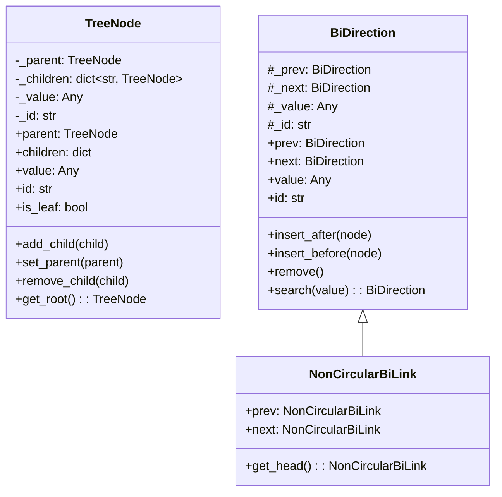

# Module: Data Structure

## 1. Overview

The Data Structure module provides reusable **tree** and **doubly-linked list** building blocks used elsewhere in the project (e.g. Memory uses `NonCircularBiLink` for `MemoryBlock`). It exposes a **TreeNode** for parent–child hierarchies keyed by child ID, and two linked-list node types: **BiDirection** (circular) and **NonCircularBiLink** (non-circular, used when list ends matter).

**Roles:**

- **Tree:** `TreeNode` — arbitrary branching, parent/children, unique node IDs.
- **Linked list:** `BiDirection` and `NonCircularBiLink` — insert before/after, remove, traverse; `NonCircularBiLink` uses `None` for head/tail.

---

## 2. Basics

### Terminology

| Term | Meaning |
|------|--------|
| **TreeNode** | Node with one parent, a dict of children (by child’s `id`), a value, and a unique `id`. |
| **BiDirection** | Circular doubly-linked node: `prev` and `next` point to other nodes (or self when alone). |
| **NonCircularBiLink** | Doubly-linked node with `prev`/`next` possibly `None` at list ends. Subclass of `BiDirection` with overridden link behavior. |
| **insert_before / insert_after** | Link a node into the list relative to the current node. |
| **get_head** | (NonCircularBiLink) Follow `prev` until the first node. |

### Entry points

- **Tree:** `from ures.data_structure import TreeNode` → build tree with `add_child(child)`, `set_parent(parent)`, traverse via `parent`, `children`.
- **Circular list:** `BiDirection(value)` → `insert_after(node)`, `insert_before(node)`, `remove()`, `search(value)`.
- **Non-circular list:** `NonCircularBiLink(value)` → same insert/remove; `get_head()` for the head of the chain. Used by Memory’s `MemoryBlock`.

---

## 3. Architecture & Logic

- **Core logic:**
  - **TreeNode:** Children stored in `_children: dict[str, TreeNode]` keyed by child’s `id`. `add_child`/`set_parent` keep parent/child references consistent. No automatic ordering of children.
  - **BiDirection:** Circular: when alone, `_prev` and `_next` point to self. Insert/remove update four pointers (self, node, prev, next).
  - **NonCircularBiLink:** Same API as BiDirection but `_prev`/`_next` initialized to `None`; insert/remove do not wrap around. `get_head()` walks `prev` to find the first element.
- **Dependencies:** Standard library only (`uuid` for IDs). Used by: `ures.memory.blocks.MemoryBlock` (extends `NonCircularBiLink`).

---

## 4. UML & Structure

### Class diagram



### Relationship

- **TreeNode** is standalone; no inheritance from list types.
- **NonCircularBiLink** extends **BiDirection** and overrides `__init__`, `prev`/`next` (nullable), `insert_after`, `insert_before`, `remove`, and adds `get_head()`.

---

## 5. Code-Level Understanding

### TreeNode

- **Identity:** Each node has a unique `_id` (uuid hex). `add_child(child)` uses `child.id` as key in `_children`.
- **Parent/child:** `set_parent(parent)` sets self’s `_parent` and adds self to `parent._children`. `remove_child(child)` removes by child’s id and clears child’s `_parent`.
- **Traversal:** No built-in iterator; callers use `node.children` (dict) or `node.parent` and recurse/walk.

### BiDirection (circular)

- **Alone:** `_prev = _next = self`.
- **insert_before(node):** `node._prev = self._prev`, `node._next = self`, `self._prev._next = node`, `self._prev = node`. So the new node sits between `self._prev` and `self`.
- **remove:** `self._prev._next = self._next`, `self._next._prev = self._prev`, then `self._prev = self._next = self`.

### NonCircularBiLink

- **Init:** `super().__init__(value)` then `_prev = _next = None` (overrides circular self-pointers).
- **insert_before(node):** `node._prev = self._prev`, `node._next = self`; if `self._prev` is not None then `self._prev._next = node`; `self._prev = node`. Handles head insertion when `self._prev is None`.
- **get_head:** Start from self, follow `_prev` until `_prev is None`; that node is the head.

### Integration

- **MemoryBlock** subclasses `NonCircularBiLink` and stores `MemoryInfo` as `_value`. Segment’s block list is a chain of MemoryBlocks; `Segment.get_blocks()` uses `first_block.get_head()` then walks `next` and filters by `segment_id`.

---

## 6. Usage & Examples

### Integration

```python
from ures.data_structure import TreeNode, BiDirection, NonCircularBiLink
```

### Tree

```python
root = TreeNode("root")
a = TreeNode("a")
b = TreeNode("b")
root.add_child(a)
root.add_child(b)
assert a.parent is root
assert root.children[a.id] is a
root.remove_child(b)
```

### Non-circular list (e.g. like Memory blocks)

```python
head = NonCircularBiLink(1)
mid = NonCircularBiLink(2)
tail = NonCircularBiLink(3)
head.insert_after(mid)
mid.insert_after(tail)
assert head.get_head() is head
assert mid.get_head() is head
mid.remove()
# head <-> tail
```

---

## 7. Public API / Interfaces

### TreeNode

| Method / property | Description |
|-------------------|-------------|
| `parent`, `children`, `value`, `id`, `is_leaf` | Properties. |
| `add_child(child)` | Add child; sets child’s parent to self. |
| `set_parent(parent)` | Set self’s parent; add self to parent’s children. |
| `remove_child(child)` | Remove by child’s id; clear child’s parent. |
| `get_root()` | Walk parent until root. |

### BiDirection / NonCircularBiLink

| Method / property | Description |
|-------------------|-------------|
| `prev`, `next`, `value`, `id` | Properties. |
| `insert_after(node)`, `insert_before(node)` | Link node into list. |
| `remove()` | Unlink self from list. |
| `search(value)` | (BiDirection) Find node with value in circular list. |
| `get_head()` | (NonCircularBiLink) Return first node of chain. |

---

## 8. Maintenance & Troubleshooting

- **Circular vs non-circular:** Use `BiDirection` when the list is circular (e.g. ring buffer). Use `NonCircularBiLink` when head/tail matter (e.g. Memory blocks in a segment).
- **TreeNode equality:** Nodes are equal by `id`, not by value. Two nodes with the same value but different ids are not equal.
- **Removed node:** After `remove()`, a BiDirection node points to self; NonCircularBiLink has `prev`/`next` set to None (implementation-dependent). Do not assume the node is still in any list.

---

## 9. Execution Protocol

1. **Map logic:** `ures/data_structure/tree.py` (TreeNode), `ures/data_structure/bi_directional_links.py` (BiDirection, NonCircularBiLink); `ures/data_structure/__init__.py` exports.
2. **Abstract:** Document purpose and structure; do not duplicate line-by-line code.
3. **Draft:** Follow this template.
4. **Review:** No sensitive keys or hardcoded paths.
