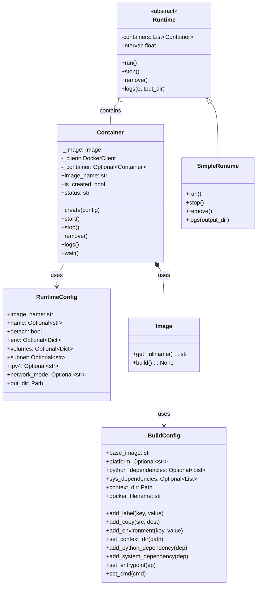
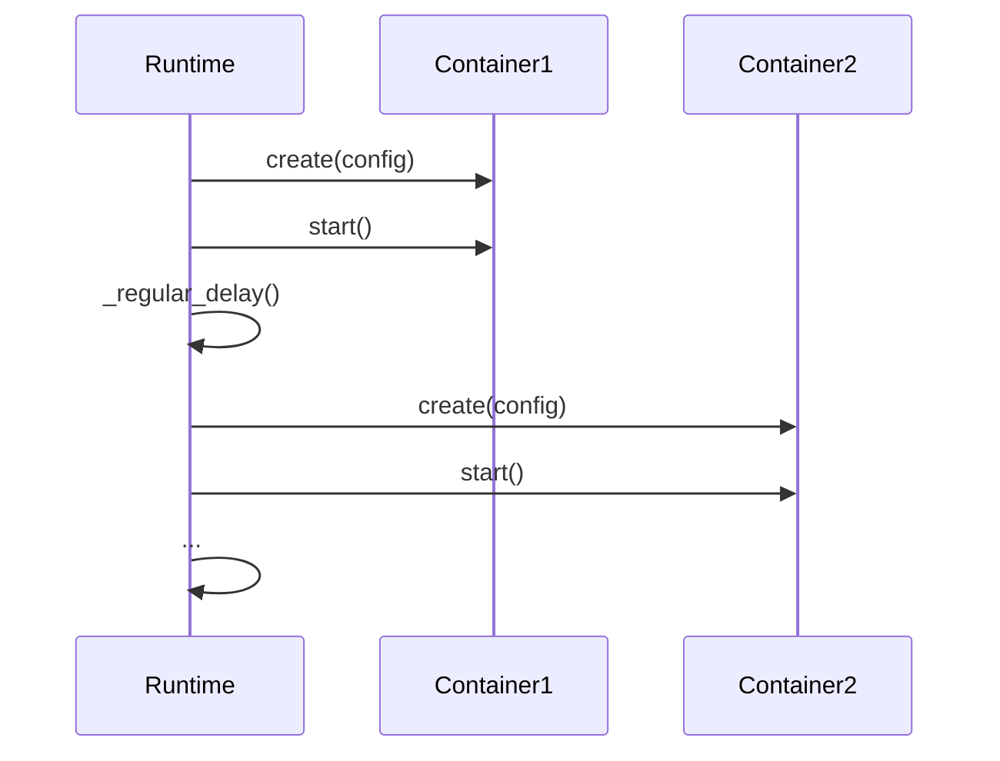

# Module: Docker

## 1. Overview

The Docker module provides **configuration**, **image building**, **container lifecycle**, and **runtime orchestration** for Docker: **BuildConfig** (Pydantic) for Dockerfile parameters, **RuntimeConfig** for run options (resources, network, volumes, etc.), **Image** for building and naming, **Container** for create/start/stop/remove/logs, and **Runtime** (e.g. SimpleRuntime) to run a set of containers with optional delay and logging. **Cleanup** and **containers** (multi-container) utilities may be present. Network helpers (subnet, IP) use `ures.network`.

**Roles:**

- **Configuration:** **BuildConfig** — base_image, platform, python/sys deps, labels, user, entrypoint, cmd, environment, copies, context_dir, docker_filename. **RuntimeConfig** — image_name, name, platform, detach, user, remove, cpus, gpus, memory, entrypoint, command, env, volumes, subnet, ipv4, network_mode, out_dir, etc.
- **Image:** **Image** class — build from BuildConfig (or name), tag, get_fullname(); interacts with Docker client to build images.
- **Container:** **Container** — wraps docker SDK Container; created from Image + RuntimeConfig (or equivalent); start, stop, remove, logs, wait; network settings from RuntimeConfig (subnet, ipv4 validated via ures.network).
- **Runtime:** Abstract **Runtime** — holds list of containers, interval (delay); run(), stop(), remove(), logs(output_dir). **SimpleRuntime** implements concrete behavior (e.g. create/start containers in order, optional delay between).
- **Conf:** **conf.py** — loading/saving or merging of BuildConfig/RuntimeConfig (e.g. from file or defaults).

---

## 2. Basics

### Terminology

| Term | Meaning |
|------|--------|
| **BuildConfig** | Pydantic model: base_image, platform, python_deps_manager, python_dependencies, sys_deps_manager, sys_dependencies, labels, uid, user, entrypoint, cmd, environment, copies, context_dir, docker_filename. Fluent helpers: add_label, add_copy, add_environment, set_context_dir, add_python_dependency, add_system_dependency, set_entrypoint, set_cmd. |
| **RuntimeConfig** | Pydantic or similar: image_name, container name, platform, detach, user, remove, cpus, gpus, memory, entrypoint, command, env, volumes, subnet, ipv4, subnet_mask, subnet_gateway, network_mode, out_dir. |
| **Image** | Builds from context + BuildConfig (or takes image name); produces tag/fullname for use by Container. |
| **Container** | Wraps docker.models.containers.Container; create from Image + runtime params; start/stop/remove/logs/wait. |
| **Runtime** | Orchestrates multiple Container instances: run (create+start), stop, remove, logs. |
| **SimpleRuntime** | Concrete Runtime implementation. |

### Entry points

- **Build:** BuildConfig() → set options → Image(build_config) or Image(name); build if needed.
- **Run:** RuntimeConfig (image_name, volumes, command, etc.) → Container(Image, client) + apply RuntimeConfig → container.start() or use Runtime(containers, interval).runtime().
- **Import:** `ures.docker.conf` (BuildConfig, RuntimeConfig), `ures.docker.image` (Image), `ures.docker.container` (Container), `ures.docker.runtime` (Runtime, SimpleRuntime), `ures.docker.containers` / `ures.docker.cleanup` if present.

---

## 3. Architecture & Logic

- **Core logic:**
  - **BuildConfig:** Pydantic defaults (e.g. base_image="python:3.10-slim", docker_filename="Dockerfile"); add_* methods mutate and return self for chaining. Used by Image to generate Dockerfile and run `client.images.build(...)`.
  - **RuntimeConfig:** Holds run parameters; Container uses it for create_options (env, volumes, network_config with subnet/ipv4 when provided). Network: verify_ip_in_subnet, is_valid_ip_netmask (ures.network) for validation.
  - **Image:** get_fullname() returns tag string; build() uses context_dir and BuildConfig to build image.
  - **Container:** create() builds create_options from RuntimeConfig (name, detach, user, env, volumes, network_config); client.containers.create(image_name, **options). start(), stop(), remove(), logs(), wait() delegate to _container.
  - **Runtime:** run() creates/starts containers (possibly with _regular_delay); stop() stops all; remove() removes all; logs() collects logs to output_dir.
- **Dependencies:** docker SDK, pydantic, ures.files.get_temp_folder (if used), ures.network (verify_ip_in_subnet, is_valid_ip_netmask), ures.tools.decorator.check_instance_variable (Container methods).

---

## 4. UML & Structure

### Class diagram (simplified)



**Existing PlantUML:** `docs/PlantUML/docker/class-docker.puml` — full BuildConfig, RuntimeConfig, Runtime, SimpleRuntime, Container, Image.

### Runtime sequence (high level)



---

## 5. Code-Level Understanding

### BuildConfig

- Pydantic model; all fields optional except base_image and context_dir/docker_filename with defaults. add_label/add_copy/add_environment append to lists or update dicts. set_context_dir accepts str or Path. Used by Image to write Dockerfile (or pass build args) and call client.images.build(context=context_dir, ...).

### RuntimeConfig

- image_name required; others optional. Container.create() maps env, volumes, network_config (from subnet/ipv4 when provided). Network: if subnet and ipv4 given, validate with verify_ip_in_subnet and is_valid_ip_netmask; build Docker network config (driver, ipam) for create_options.

### Container

- __init__(image: Image, client=None): client or docker.from_env(). create(runtime_config): build create_options (image=get_fullname(), name, detach, user, remove, env, volumes, host_config or network_config); self._container = client.containers.create(...). start/stop/remove/logs/wait call _container methods. Methods may be decorated with @check_instance_variable("_client") or similar so they no-op if client is None.

### Runtime

- Holds list of Container; interval for delay between starts. run(): for each container, create (if config provided), start, then delay. stop(): stop each. remove(): remove each. logs(output_dir): for each container, fetch logs and write to output_dir (e.g. by container name).

### Image

- Constructed with BuildConfig or image name. build(): generate Dockerfile from BuildConfig, run docker build in context_dir. get_fullname(): return "name:tag" for use in create.

---

## 6. Usage & Examples

### Integration

```python
from ures.docker.conf import BuildConfig, RuntimeConfig
from ures.docker.image import Image
from ures.docker.container import Container
from ures.docker.runtime import Runtime, SimpleRuntime
```

### Build and run one container

```python
build_cfg = BuildConfig()
build_cfg.set_context_dir("/path/to/context").add_python_dependency("requests")
img = Image(build_cfg)
img.build()
runtime_cfg = RuntimeConfig(image_name=img.get_fullname(), detach=True, out_dir=Path("/tmp/logs"))
container = Container(img)
container.create(runtime_cfg)
container.start()
# ...
container.stop()
container.remove()
```

### Runtime (multiple containers)

```python
containers = [Container(Image("a:latest")), Container(Image("b:latest"))]
runtime = SimpleRuntime(containers=containers, interval=2.0)
runtime.run()
runtime.logs(Path("/tmp/logs"))
runtime.stop()
runtime.remove()
```

---

## 7. Public API / Interfaces

### BuildConfig

| Member | Description |
|--------|-------------|
| base_image, platform, python_deps_manager, python_dependencies, sys_deps_manager, sys_dependencies | Build parameters. |
| labels, uid, user, entrypoint, cmd, environment, copies | Optional. |
| context_dir, docker_filename | Path and Dockerfile name. |
| add_label, add_copy, add_environment, set_context_dir | Fluent setters. |
| add_python_dependency, add_system_dependency, set_entrypoint, set_cmd | Fluent setters. |

### RuntimeConfig

| Member | Description |
|--------|-------------|
| image_name, name, platform, detach, user, remove | Run options. |
| cpus, gpus, memory, entrypoint, command, env, volumes | Resources and execution. |
| subnet, ipv4, subnet_mask, subnet_gateway, network_mode | Network. |
| out_dir | Log/output directory. |

### Image

| Method | Description |
|--------|-------------|
| get_fullname() | Full image name (name:tag). |
| build() | Build from BuildConfig/context. |

### Container

| Method / property | Description |
|-------------------|-------------|
| image_name, is_created, status | Properties. |
| create(runtime_config) | Create container from config. |
| start(), stop(), remove() | Lifecycle. |
| logs(), wait() | Output and blocking wait. |

### Runtime

| Method | Description |
|--------|-------------|
| run() | Create and start containers (with optional delay). |
| stop() | Stop all. |
| remove() | Remove all. |
| logs(output_dir) | Write logs to directory. |

---

## 8. Maintenance & Troubleshooting

- **Network:** Subnet and ipv4 must be valid (verify_ip_in_subnet, is_valid_ip_netmask). Invalid values should be rejected before create.
- **Client:** Container methods that need Docker client should check _client is not None (e.g. via check_instance_variable) to avoid runtime errors.
- **Temp dirs:** BuildConfig/Image may use get_temp_folder for intermediate files; ensure cleanup or use get_temp_dir_with_specific_path for predictable paths.
- **Platform:** BuildConfig.platform and RuntimeConfig.platform (e.g. linux/amd64) must match host/engine when building and running.

---

## 9. Execution Protocol

1. **Map logic:** `ures/docker/conf.py` (BuildConfig, RuntimeConfig), `ures/docker/image.py`, `ures/docker/container.py`, `ures/docker/containers.py` (if present), `ures/docker/runtime.py`, `ures/docker/cleanup.py` (if present); `ures/docker/__init__.py`.
2. **Abstract:** Document purpose and flow; do not duplicate line-by-line code.
3. **Draft:** Follow this template; reference docs/PlantUML/docker/class-docker.puml.
4. **Review:** No sensitive keys or hardcoded paths; no credentials in docs.
