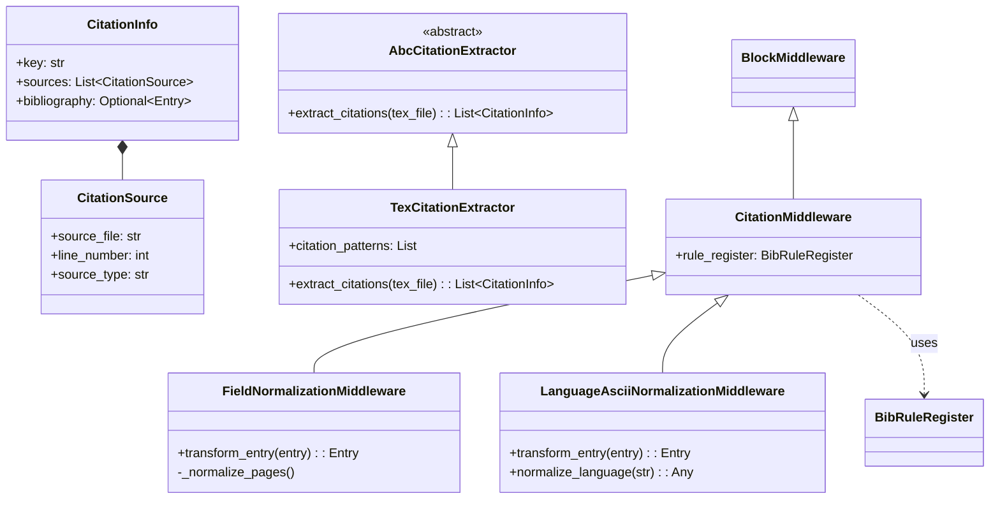
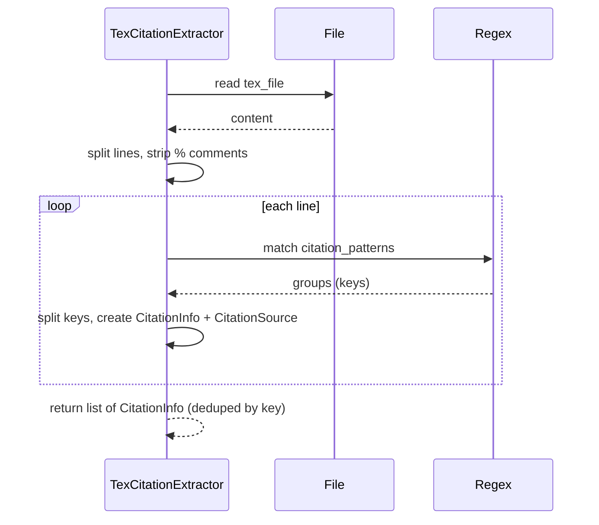

# Module: Literature Citation

## 1. Overview

The Literature Citation module handles **citation extraction** from LaTeX files and **bibliography normalization** via bibtexparser **middlewares** and **rules**. It produces **CitationInfo** (cite key + source locations + optional bibliography entry) and supports **rule-based** field mapping and validation per entry type (e.g. article, conference).

**Roles:**

- **Extractors:** `AbcCitationExtractor` abstract base; `TexCitationExtractor` finds `\cite`, `\citep`, `\citet`, `\citeauthor`, `\citeyear`, `\parencite`, `\textcite`, `\nocite`, etc., and builds a list of **CitationInfo** with **CitationSource** (file, line, type).
- **Middlewares:** bibtexparser `BlockMiddleware` subclasses: **FieldNormalizationMiddleware** (field renames, page normalization), **LanguageAsciiNormalizationMiddleware** (langid to ISO 639-1). Transform entries in a pipeline.
- **Rules:** **BibRuleRegister** (or equivalent) supplies per–entry-type field mappings and default mappings; used by normalization middleware.
- **Data:** **CitationSource** (source_file, line_number, source_type), **CitationInfo** (key, sources list, optional bibliography Entry).

---

## 2. Basics

### Terminology

| Term | Meaning |
|------|--------|
| **CitationInfo** | key (cite key), sources (list of CitationSource), optional bibliography (bibtexparser Entry). |
| **CitationSource** | source_file, line_number, source_type — where the citation was found. |
| **TexCitationExtractor** | Scans .tex for citation commands; extracts keys (comma-separated); ignores commented lines (% not escaped). |
| **FieldNormalizationMiddleware** | Maps field names (e.g. journaltitle→journal), normalizes pages (dashes). |
| **BibRuleRegister** | Provides field_mappings and rules per entry_type. |
| **langid** | Normalized to ISO 639-1 (e.g. pinyin→zh). |

### Entry points

- **Extract citations:** `TexCitationExtractor().extract_citations(tex_file)` → list of CitationInfo.
- **Normalize .bib:** Load .bib with bibtexparser; add middlewares (FieldNormalization, LanguageAscii); parse/transform; write back or use entries.
- **Rules:** Register rules per entry type; middleware calls `rule_register.get_rule(entry.entry_type)` and `get_default_field_mapping()`.

---

## 3. Architecture & Logic

- **Core logic:**
  - **Extraction:** Read .tex; split lines; for each line strip content after unescaped `%`; apply regex patterns for each citation command; last group = keys string; split by comma; build CitationInfo per key with CitationSource(file, line_no, type). Dedupe by key (first occurrence wins or merge sources).
  - **Middlewares:** Inherit bibtexparser `BlockMiddleware`; implement `transform_entry(entry, ...)`; return modified entry. Field normalization uses rule_register for field_mappings and normalizes pages (—/–/single dash → consistent).
  - **Rules:** Entry-type–specific field mappings and default mapping; used to rename keys on Entry fields.
- **Dependencies:** bibtexparser, pycountry (language), ures.string.string2date (if used in rules); re, pathlib.

---

## 4. UML & Structure

### Class diagram



### Extraction flow



---

## 5. Code-Level Understanding

### TexCitationExtractor

- **Patterns:** Include `\cite{...}`, `\cite[...]{...}`, `\citep`, `\citet`, `\citeauthor`, `\citeyear`, `\parencite`, `\textcite`, `\nocite`, etc. Last group of each match is the keys string.
- **Comment handling:** For each line, find unescaped `%`; if found, only the part before it is scanned for citations.
- **Deduplication:** Typically one CitationInfo per key; append CitationSource for each occurrence or keep first (implementation may merge sources).

### FieldNormalizationMiddleware

- **transform_entry:** For each field: if key is "pages", normalize with _normalize_pages (replace —/– with --, single - with --). Then get field_mappings from rule_register (entry type + default); set field.key = field_mappings.get(field.key, field.key).
- **_normalize_pages:** String only; dash variants normalized to "--"; strip.

### LanguageAsciiNormalizationMiddleware

- **transform_entry:** For field key "langid", set value to normalize_language(value). normalize_language: special cases (e.g. pinyin→zh); else pycountry or similar for ISO 639-1.

### Rules

- **BibRuleRegister:** get_rule(entry_type) returns an object with field_mappings. get_default_field_mapping() returns base mapping. Used to avoid hardcoding field names across styles.

---

## 6. Usage & Examples

### Integration

```python
from ures.literature.citation import TexCitationExtractor  # or from citation.extractors
from ures.literature.citation.extractors import CitationInfo, CitationSource
from ures.literature.citation.middlewares import FieldNormalizationMiddleware, LanguageAsciiNormalizationMiddleware
from ures.literature.citation.rules import BibRuleRegister
```

### Extract citations

```python
extractor = TexCitationExtractor()
citations = extractor.extract_citations("main.tex")
for c in citations:
    print(c.key, c.sources)
```

### Normalize bibliography (conceptual)

```python
import bibtexparser
from ures.literature.citation.middlewares import FieldNormalizationMiddleware
from ures.literature.citation.rules import BibRuleRegister

register = BibRuleRegister()
db = bibtexparser.parse_string(bib_str)
db = bibtexparser.add_middleware(FieldNormalizationMiddleware(register), db)
# parse/transform/write
```

---

## 7. Public API / Interfaces

### Data

| Type | Fields / description |
|------|----------------------|
| **CitationSource** | source_file (str), line_number (int), source_type (str). |
| **CitationInfo** | key (str), sources (List[CitationSource]), bibliography (Optional[Entry]). |

### Extractors

| Symbol | Description |
|--------|-------------|
| **AbcCitationExtractor** | Abstract: extract_citations(tex_file) → list[CitationInfo]. |
| **TexCitationExtractor** | Implements extraction with citation_patterns. |

### Middlewares

| Class | Description |
|-------|-------------|
| **CitationMiddleware** | Base BlockMiddleware with optional rule_register. |
| **FieldNormalizationMiddleware** | Rename fields via rules; normalize pages. |
| **LanguageAsciiNormalizationMiddleware** | Normalize langid to ISO 639-1. |

### Rules

| Symbol | Description |
|--------|-------------|
| **BibRuleRegister** | get_rule(entry_type), get_default_field_mapping(). |

---

## 8. Maintenance & Troubleshooting

- **Comment handling:** Only unescaped `%` starts a comment; `\%` keeps the rest of the line visible to patterns.
- **New citation commands:** Add regex to TexCitationExtractor.citation_patterns; last group must be the keys.
- **Field mappings:** Update BibRuleRegister (data_type or rule modules) for new entry types or style changes.
- **Pages:** Normalization assumes string; non-string may be coerced to str.

---

## 9. Execution Protocol

1. **Map logic:** `ures/literature/citation/extractors.py` (CitationSource, CitationInfo, AbcCitationExtractor, TexCitationExtractor), `ures/literature/citation/middlewares.py`, `ures/literature/citation/rules/` (BibRuleRegister, data_type, style-specific rules), `ures/literature/citation/__init__.py`, optional manager.
2. **Abstract:** Document purpose and pipeline; do not duplicate line-by-line code.
3. **Draft:** Follow this template.
4. **Review:** No sensitive keys or hardcoded paths.
