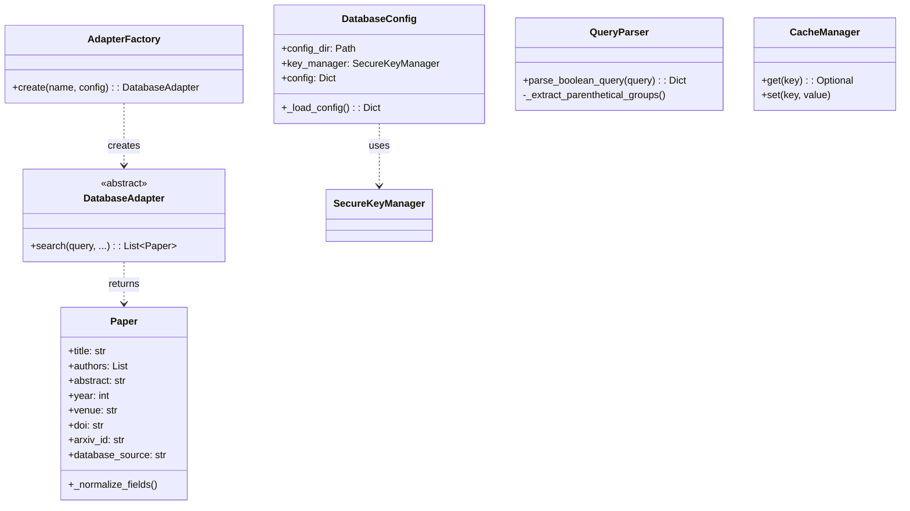
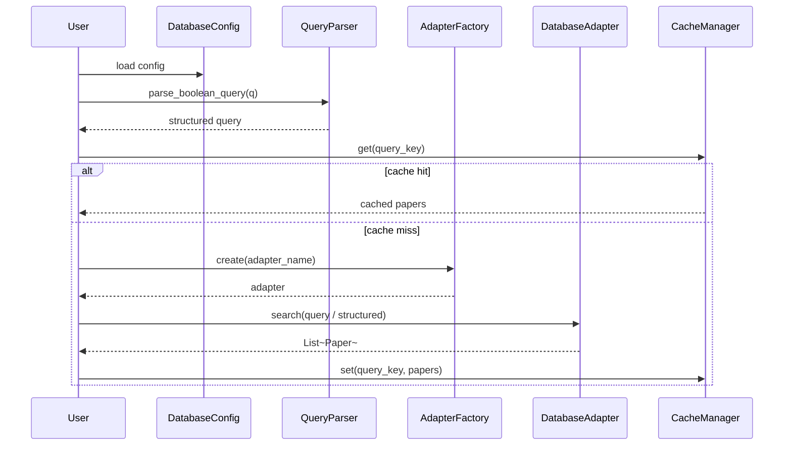

# Module: Literature Search

## 1. Overview

The Literature Search module provides **configurable multi-source paper search**: configuration (databases, cache, API keys), **Paper** data model and **CacheManager**, **adapters** (e.g. ArXiv, IEEE) with a **QueryParser** for Boolean queries, and a **DatabaseConfig** that integrates **SecureKeyManager** for keys. A **search** facade (and optional CLI in `search_cli.py`) runs queries across enabled adapters, deduplicates, and can export results.

**Roles:**

- **Configuration:** `DatabaseConfig` — load/save JSON config; per-database enabled/rate_limit/categories; cache dir and expiry; SecureKeyManager for API keys.
- **Model & cache:** `Paper` dataclass (title, authors, abstract, year, venue, doi, arxiv_id, etc.); `CacheManager` for caching search results (e.g. by query hash).
- **Adapters:** Abstract `DatabaseAdapter`; concrete adapters (e.g. ArXiv) implement search and map hits to `Paper`; `AdapterFactory` returns adapter by name.
- **Query parsing:** `QueryParser` — parse Boolean queries (AND/OR, quoted phrases, parentheses) into a structured form for adapter-specific translation.
- **Search orchestration:** High-level search that uses config, adapters, cache, and deduplication to return a list of `Paper`.

---

## 2. Basics

### Terminology

| Term | Meaning |
|------|--------|
| **Paper** | Dataclass: title, authors, abstract, year, venue, doi, arxiv_id, url, citations, keywords, database_source, pdf_url, publication_type, issue, volume, pages, publisher. Normalized on init. |
| **DatabaseAdapter** | Abstract interface: search capability returning papers. |
| **AdapterFactory** | Creates adapter instances by database name (from config). |
| **QueryParser** | Parses Boolean query string into quoted phrases and groups (AND/OR/SINGLE). |
| **DatabaseConfig** | Config dir, app name, SecureKeyManager; lit_search_config.json with databases, cache, search, export sections. |
| **CacheManager** | Caches search results (e.g. by query hash); expiry and max age from config. |

### Entry points

- **Programmatic:** Use `DatabaseConfig`, get adapters via factory, run `QueryParser.parse_boolean_query`, call adapter search methods, deduplicate/export as needed. Or use the high-level search API if exposed (e.g. a Search class that wraps config + adapters + cache).
- **CLI:** `ures.literature.search_cli` (when used as script) for search/export commands.
- **Import:** `from ures.literature.search import Paper, CacheManager, DatabaseConfig`; adapters and factory from `ures.literature.search.adapters`.

---

## 3. Architecture & Logic

- **Core logic:**
  - **DatabaseConfig:** Loads JSON from config_dir; merges with defaults; ensures each DB has a key slot in SecureKeyManager (dummy if missing). Saves back to JSON.
  - **Paper:** `__post_init__` normalizes text (whitespace, HTML entities), author names, DOI, year bounds, citations; publication_type lowercased.
  - **QueryParser:** Extract quoted phrases with placeholders; parse parentheses for nested groups; split on OR/AND; restore phrases in terms; return structure with quoted_phrases and groups.
  - **Adapters:** Each adapter uses config (rate limit, categories) and optional API key; fetches from external API, parses response into list of Paper.
  - **Cache:** CacheManager hashes query (or similar) and stores results; checks expiry/max_age before returning.
- **Dependencies:** Internal: `ures.secrets.SecureKeyManager`, `StorageMethod`. External: requests, BeautifulSoup, bibtexparser (if used), pathlib, json, sqlite3 (CacheManager), etc.

---

## 4. UML & Structure

### Class diagram (simplified)



### Data flow (search)



---

## 5. Code-Level Understanding

### Paper normalization

- **Text:** Strip, collapse whitespace, strip HTML-like tags, unescape &amp;/&lt;/&gt;.
- **Authors:** Clean each name; drop empty.
- **Year:** Clamp to 1900–2030 or set 0.
- **DOI:** Normalized (lowercase, strip prefix, etc. per _normalize_doi).
- **Citations:** int ≥ 0.
- **publication_type:** Lowercased.

### QueryParser

- Protects quoted phrases with placeholders `__PHRASE_i__`; finds matching parentheses for groups; within each group content, splits on OR then AND; restores phrases into terms. Output: `quoted_phrases`, `groups` (each with type and terms), `original_query`.

### Adapters

- Typically: build request from config + parsed query; rate limit; HTTP request; parse XML/HTML/JSON; map to Paper list; set database_source.

### Config and keys

- Default config defines databases (arxiv, ieee, springer, etc.) with enabled, rate_limit, categories (where applicable). Cache section: directory, expire_days, max_age_hours. Search: max_results, deduplication, min_year, similarity_threshold. Export: default_format, include_abstracts, max_export_size. Keys are stored per db name via SecureKeyManager (dummy placeholder if missing).

---

## 6. Usage & Examples

### Integration

```python
from ures.literature.search import DatabaseConfig, Paper, CacheManager
from ures.literature.search.adapters import AdapterFactory, DatabaseAdapter
from ures.literature.search.paper import PaperFormatter  # if needed
```

### Config and search (conceptual)

```python
config = DatabaseConfig(app_name="literature-search")
parser = QueryParser()
structured = parser.parse_boolean_query('("machine learning" AND deep) OR nlp')
factory = AdapterFactory(config)
adapter = factory.create("arxiv", config.config)
papers = adapter.search(structured or "machine learning", max_results=50)
# Deduplicate/export per project conventions
```

---

## 7. Public API / Interfaces

### Paper

| Attribute | Type | Description |
|-----------|------|-------------|
| title, authors, abstract, year, venue, doi, arxiv_id, url | str / list / int | Core metadata. |
| citations, keywords, database_source, pdf_url | int / list / str | Optional. |
| publication_type, issue, volume, pages, publisher | str | Publication details. |

### DatabaseConfig

| Member | Description |
|--------|-------------|
| `config_dir`, `app_name`, `config` | Config path and loaded dict. |
| `config_path` | Path to lit_search_config.json. |
| `_load_config()` | Load/merge with defaults; init key slots. |

### QueryParser

| Method | Description |
|--------|-------------|
| `parse_boolean_query(query)` | Returns dict: quoted_phrases, groups (type + terms), original_query. |

### Adapters

| Symbol | Description |
|--------|-------------|
| `DatabaseAdapter` | Abstract base; search returns list of Paper. |
| `AdapterFactory.create(name, config)` | Return adapter for name. |

### CacheManager

| Method | Description |
|--------|-------------|
| `get(key)` | Cached value or None. |
| `set(key, value)` | Store with expiry. |

---

## 8. Maintenance & Troubleshooting

- **API keys:** Stored via SecureKeyManager; ensure keys are set for enabled DBs that require them (e.g. IEEE, Elsevier). Dummy placeholder only reserves the slot.
- **Rate limits:** Config rate_limit per database; adapters should throttle requests.
- **Deduplication:** Search config has similarity_threshold; dedupe logic may use title/abstract similarity or DOI/arxiv_id.
- **QueryParser:** Complex nested Boolean may need testing; quoted phrases and parentheses must balance.

---

## 9. Execution Protocol

1. **Map logic:** `ures/literature/search/search.py` (DatabaseConfig, search orchestration), `ures/literature/search/paper.py` (Paper, CacheManager), `ures/literature/search/adapters.py` (DatabaseAdapter, adapters, AdapterFactory, QueryParser); `ures/literature/search_cli.py` for CLI.
2. **Abstract:** Document purpose and flow; do not duplicate line-by-line code.
3. **Draft:** Follow this template.
4. **Review:** No API keys or sensitive paths in docs.
