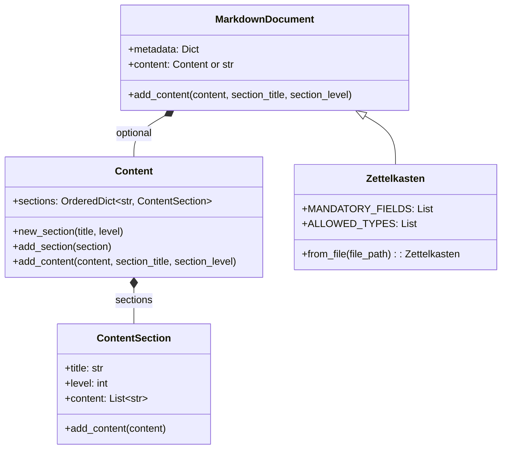
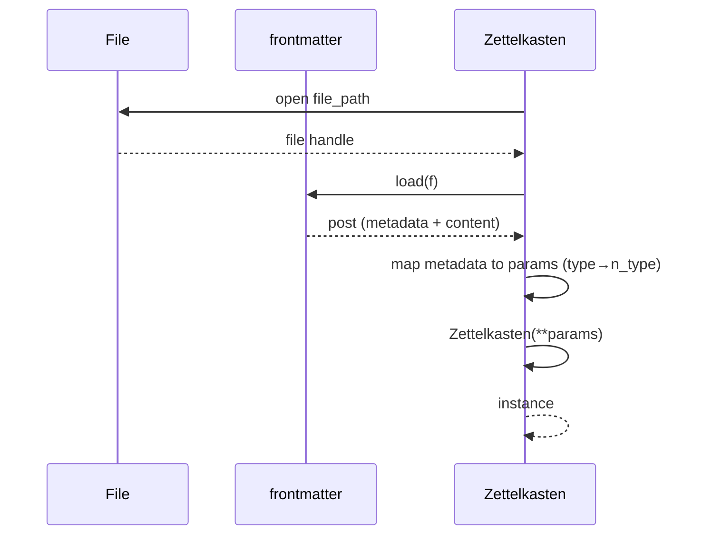

# Module: Markdown

## 1. Overview

The Markdown module provides **structured markdown documents** with **YAML frontmatter** and **sectioned body content**, and a **Zettelkasten** note type that enforces mandatory fields and allowed note types (fleeting, literature, permanent, atom). It builds on the `frontmatter` library for parsing/serializing front matter and uses **Content** / **ContentSection** to represent the body as a hierarchy of sections.

**Roles:**

- **Manipulator:** `MarkdownDocument` — metadata (dict) + content (body); **Content** holds **ContentSection** objects keyed by title; **frontmatter** load/dump for read/write. Helper to add content to sections and manage structure.
- **Zettelkasten:** Subclass of MarkdownDocument with fixed **MANDATORY_FIELDS** (title, type, url, create, id, tags, aliases) and **ALLOWED_TYPES** (fleeting, literature, permanent, atom). Generates `id` (zettelkasten_id) and `create` (time_now) by default; **from_file** loads a path and constructs a Zettelkasten from front matter.

---

## 2. Basics

### Terminology

| Term | Meaning |
|------|--------|
| **MarkdownDocument** | Document with metadata dict and content (Content or raw body). Uses frontmatter for serialization. |
| **Content** | Container of **ContentSection** objects in order (OrderedDict by section title). |
| **ContentSection** | title, level (heading level 1–6), content (list of lines). |
| **Zettelkasten** | Note type: mandatory title, type, url, create, id, tags, aliases; type in ALLOWED_TYPES. |
| **frontmatter** | Library: load(f) / dump(post) for YAML + body. |
| **MANDATORY_FIELDS / ALLOWED_TYPES** | Class-level lists on Zettelkasten. |

### Entry points

- **Generic document:** `MarkdownDocument(metadata=..., content=...)`; use Content and ContentSection for structured body; dump with frontmatter.
- **Zettelkasten note:** `Zettelkasten(title=..., n_type=..., url=..., tags=..., aliases=..., **kwargs)` or `Zettelkasten.from_file(file_path)`.
- **Import:** `from ures.markdown import Zettelkasten`; `from ures.markdown.manipulator import MarkdownDocument, Content, ContentSection, frontmatter`.

---

## 3. Architecture & Logic

- **Core logic:**
  - **MarkdownDocument:** Holds metadata and content. When content is Content, sections are ordered; add_content(section_title, section_level) creates or targets a section and appends lines. Dump: frontmatter.dump (metadata + body string).
  - **Content:** new_section(title, level), add_section(section), add_content(content, section_title, section_level). Body string built from sections (headings + lines).
  - **Zettelkasten:** __init__ validates title (non-empty str), n_type in ALLOWED_TYPES, url/tags/aliases types; sets id=zettelkasten_id(), create=time_now(); passes metadata to super(). from_file: open path, frontmatter.load; map metadata to Zettelkasten params (type → n_type); instantiate Zettelkasten(**_params).
- **Dependencies:** frontmatter library; ures.timedate.time_now; ures.string.zettelkasten_id; ures.markdown.manipulator (Content, ContentSection).

---

## 4. UML & Structure

### Class diagram



### PlantUML reference

- Existing diagrams (if any): `docs/PlantUML/markdown/graph_class.puml`, `graph_sequence.puml`.

### Load from file (Zettelkasten)



---

## 5. Code-Level Understanding

### Content and ContentSection

- **ContentSection:** title and level set in __init__; content is a list; add_content appends string or list of strings.
- **Content:** OrderedDict preserves section order; new_section only adds if title not in sections; add_content(content, section_title="default", section_level=1) creates section if missing and appends to that section’s content list.

### MarkdownDocument

- Metadata is stored as-is. Content can be a Content instance or a raw string. When building body from Content, typically: for each section, emit "#" * level + " " + title, then section content lines.

### Zettelkasten validation

- title: non-empty string. n_type: must be in ALLOWED_TYPES. url: string or None. tags/aliases: list or None (stored as [] if None). id and create set automatically unless overridden in kwargs. from_file ensures keywords title, n_type, url, tags, aliases exist in _params (None if missing).

### frontmatter

- load(f) returns object with .metadata and .content (body). dump(post) writes YAML delimiter + metadata + body. Invalid front matter raises frontmatter.InvalidFrontMatterError.

---

## 6. Usage & Examples

### Integration

```python
from ures.markdown import Zettelkasten
from ures.markdown.manipulator import MarkdownDocument, Content, ContentSection, frontmatter
```

### Zettelkasten

```python
zk = Zettelkasten(title="My Note", n_type="permanent", url="https://example.com", tags=["tag1"], aliases=[])
# zk.metadata has id, create, title, type, url, tags, aliases

zk2 = Zettelkasten.from_file("/path/to/note.md")
```

### Structured content

```python
doc = MarkdownDocument(metadata={"title": "Doc"}, content=Content())
doc.content.new_section("Intro", 1)
doc.content.add_content("Hello world.", "Intro", 1)
doc.content.new_section("Details", 2)
doc.content.add_content(["Line 1", "Line 2"], "Details", 2)
# Then dump with frontmatter to get full markdown string
```

---

## 7. Public API / Interfaces

### MarkdownDocument

| Member | Description |
|--------|-------------|
| metadata | Dict for front matter. |
| content | Content instance or str. |
| add_content(content, section_title, section_level) | Append to section; create section if needed. |

### Content

| Method | Description |
|--------|-------------|
| new_section(title, level) | Add empty section if title not present. |
| add_section(section) | Add ContentSection if title not present. |
| add_content(content, section_title, section_level) | Append to section; create if needed. |

### ContentSection

| Member | Description |
|--------|-------------|
| title, level, content | Section heading and lines. |
| add_content(content) | Append string or list of strings. |

### Zettelkasten

| Member | Description |
|--------|-------------|
| MANDATORY_FIELDS, ALLOWED_TYPES | Class constants. |
| __init__(title, n_type, url=None, tags=None, aliases=None, **kwargs) | Validates and sets id, create. |
| from_file(file_path) | Load path; frontmatter.load; return Zettelkasten instance. |

---

## 8. Maintenance & Troubleshooting

- **from_file:** Raises FileNotFoundError if path does not exist; InvalidFrontMatterError if YAML is malformed. Missing metadata keys are set to None for title, n_type, url, tags, aliases.
- **Zettelkasten type:** Only ALLOWED_TYPES accepted; ValueError for invalid n_type.
- **Section title uniqueness:** Content uses title as key; duplicate title overwrites or is ignored depending on new_section/add_section logic (doc says "if not exist" for add_section).

---

## 9. Execution Protocol

1. **Map logic:** `ures/markdown/manipulator.py` (ContentSection, Content, MarkdownDocument), `ures/markdown/zettelkasten.py` (Zettelkasten); `ures/markdown/__init__.py` exports.
2. **Abstract:** Document purpose and structure; do not duplicate line-by-line code.
3. **Draft:** Follow this template; reference PlantUML if present.
4. **Review:** No sensitive keys or hardcoded paths.
