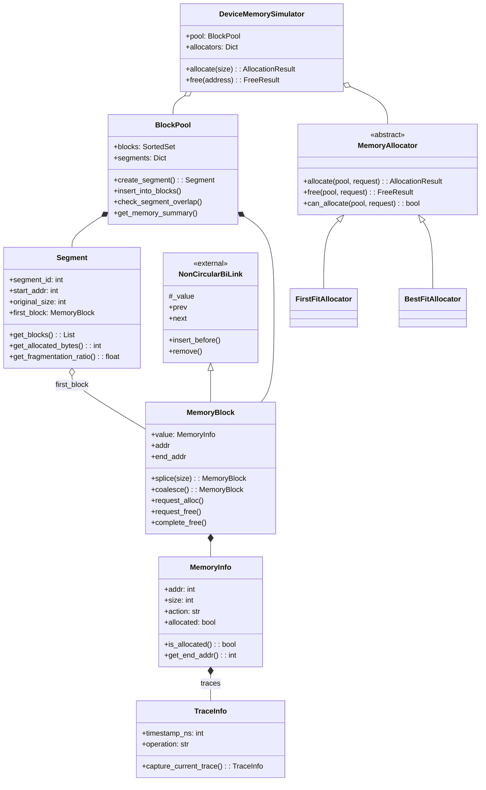
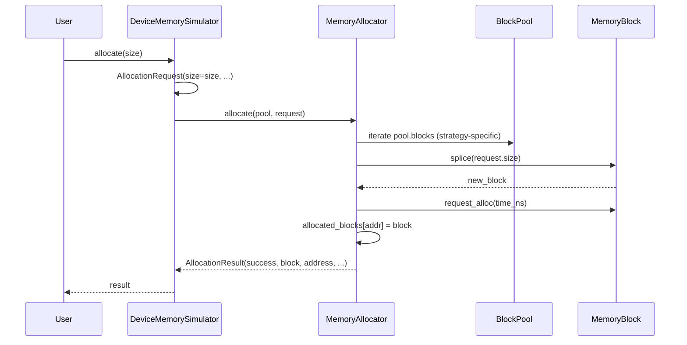

# Module: Memory

## 1. Overview

The Memory module provides a **simulated device memory system** with pluggable allocation strategies. It models contiguous address space as **segments** that are split into **blocks** held in a **pool**. Allocators (First Fit, Best Fit, Worst Fit, Next Fit, Buddy System) operate on the pool by splitting free blocks and coalescing on free. The design supports device/stream semantics and optional **tracing** for debugging and profiling. It does not allocate real OS memory; it is a simulation layer for algorithms and testing.

**Roles:**

- **Block layer** (`blocks.py`): `BlockPool`, `MemoryBlock`, `Segment`, `MemoryInfo`, `TraceInfo` — representation of memory regions and lifecycle.
- **Allocator layer** (`allocator.py`): Abstract `MemoryAllocator` and concrete strategies; `DeviceMemorySimulator` as the facade that owns a pool and one active allocator.

---

## 2. Basics

### Terminology

| Term | Meaning |
|------|--------|
| **Segment** | A contiguous region created from the pool (e.g. one “device allocation”). Has `segment_id`, `start_addr`, `original_size`, optional `device`/`stream`. Tracks utilization and fragmentation. |
| **Block** | A contiguous sub-region of a segment. Implemented as a node in a doubly-linked list (`NonCircularBiLink`). Can be **free** or **allocated**. |
| **Pool** | `BlockPool`: holds all blocks in a `SortedSet` (by stream, size, addr) and all segments. Creates segments, checks overlap, finds safe address ranges. |
| **Splice** | Split a free block: take a prefix of size `memory_size` as a new block, shrink the current block and link them. Used for allocation. |
| **Coalesce** | Merge a free block with adjacent free blocks in the same segment to reduce fragmentation. |
| **Allocator** | Strategy that implements `allocate(pool, request)` and `free(pool, request)` using the pool’s blocks (e.g. first fit, best fit, buddy). |
| **Trace** | `TraceInfo`: optional capture of call site and timestamp for operations (create, alloc, free_request, free_complete, split, coalesce). |

### Entry points

- **Use the simulator:** `DeviceMemorySimulator(device_id, total_memory, base_address)` → `allocate(size, ...)`, `free(address, ...)`, `get_memory_info()`, `simulate_workload(...)`.
- **Use pool + allocator directly:** `BlockPool()`, `pool.create_segment(...)`, then a concrete allocator (e.g. `FirstFitAllocator()`) and `allocator.allocate(pool, AllocationRequest(size=...))`.
- **Public API:** `ures.memory` exports `BlockPool`, `MemoryBlock`, `Segment`, `MemoryInfo`, `TraceInfo`, `AllocationRequest`, `AllocationResult`, `FreeRequest`, `FreeResult`, `MemoryAllocator`, concrete allocators, `DeviceMemorySimulator`.

---

## 3. Architecture & Logic

- **Core logic:**
  - **Segment creation:** `BlockPool.create_segment(start_addr, size, ...)` checks overlap via `check_segment_overlap`, creates a `Segment` and one initial `MemoryBlock` covering the range, registers the segment and inserts the block into `pool.blocks`.
  - **Allocation:** Allocator finds a suitable free block (strategy-dependent), calls `block.splice(request.size)` to obtain a new block, calls `allocated_block.request_alloc(time_ns)`, registers the block in `allocated_blocks`, returns `AllocationResult`.
  - **Free:** Allocator looks up address in `allocated_blocks`, validates optional `expected_size`, calls `block.request_free(time_ns)`, `block.complete_free()`, then `block.coalesce()` to merge with adjacent free blocks, removes from `allocated_blocks`, returns `FreeResult`.
- **Dependencies:** Internal: `ures.data_structure.NonCircularBiLink` (MemoryBlock extends it), `sortedcontainers.SortedSet`. No other ures packages.

---

## 4. UML & Structure

### Class diagram (simplified)

Mermaid version for quick reference. Full diagrams with all fields and relationships are in PlantUML.



**Existing PlantUML (authoritative detail):**

- **Blocks and pool:** `docs/PlantUML/memory/class-blocks.puml` — TraceInfo, MemoryInfo, Segment, MemoryBlock, BlockPool, SortedSet.
- **Allocators:** `docs/PlantUML/memory/class-allocator.puml` — AllocationStrategy, request/result dataclasses, MemoryAllocator hierarchy, DeviceMemorySimulator.
- **Sequence – splice:** `docs/PlantUML/memory/sequence-MemoryBlock-splice.puml` — steps of splitting a block.
- **Sequence – coalesce:** `docs/PlantUML/memory/sequence-MemoryBlock-coalesce.puml` — merging adjacent free blocks.
- **Sequence – segment creation:** `docs/PlantUML/memory/sequence-BlockPool-createSeg.puml` — create_segment flow.

### Allocation sequence (high level)



---

## 5. Code-Level Understanding

### Data flow (allocation)

1. **DeviceMemorySimulator.allocate(size, ...)**
   Builds `AllocationRequest`, calls `current_allocator.allocate(self.pool, request)`, appends to `allocation_history`, returns `AllocationResult`.

2. **Concrete allocator (e.g. FirstFitAllocator.allocate)**
   Iterates `pool.blocks` (order depends on strategy). For each block: if free, size ≥ request.size, and stream matches, calls `block.splice(request.size)` → new block; calls `new_block.request_alloc(time_ns)`; stores in `self.allocated_blocks[new_block.addr]`; returns `AllocationResult(success=True, block=..., address=..., ...)`. If no block fits, returns `AllocationResult(success=False, error_message=...)`.

3. **MemoryBlock.splice(memory_size)**
   If block is allocated → `MemoryError`. If `memory_size > self.value.size` → `ValueError`. If `memory_size == self.value.size` → remove self from pool if present, return self. Otherwise: create new `MemoryBlock(addr=self.value.addr, size=memory_size, ...)`; shrink self (`value.size -= memory_size`, `value.addr += memory_size`); link with `insert_before(new_block)`; update `segment.first_block` if self was first; optionally capture split trace; return new block. The new block is not automatically added to `pool.blocks` — the allocator uses it as the allocated block; the remainder stays in the list and in the pool.

4. **MemoryBlock.request_alloc(time_ns)**
   Sets `value.action = "alloc"`, `value.allocated = True`, `value.alloc_time_ns`; optionally appends a trace.

### Data flow (free)

1. **DeviceMemorySimulator.free(address, expected_size)**
   Builds `FreeRequest`, calls `current_allocator.free(self.pool, request)`, appends to `free_history`, returns `FreeResult`.

2. **Allocator.free**
   Looks up `request.address` in `allocated_blocks`. If missing or size mismatch → `FreeResult(success=False, ...)`. Else: `block.request_free(time_ns)`, `block.complete_free()`, `coalesced_block = block.coalesce()`, remove from `allocated_blocks`, return `FreeResult(success=True, freed_size=..., coalesced=..., ...)`.

3. **MemoryBlock.coalesce()**
   If allocated → `MemoryError`. Collects adjacent prev/next free blocks in same segment; removes them from the list and pool; merges sizes and updates address if merging with prev; updates `segment.first_block` if needed; optionally adds coalesce trace; re-inserts merged block into pool; returns (possibly updated) self.

### Key types

- **SortedSet key:** `(block.stream, block.value.size, block.addr)` — iteration order and lookup behavior depend on this.
- **Block lifecycle (MemoryInfo.action):** `"free"` → `"alloc"` (request_alloc) → `"free_requested"` (request_free) → `"free_completed"` (complete_free). `is_allocated()` is true for `"alloc"` and `"free_requested"`.
- **BuddySystemAllocator:** Rounds request size to power of two; on free, merges with buddy repeatedly (buddy address = `addr ^ size`). Uses `splice` for splits; merge is custom (adjusts sizes and removes buddy from list/pool).

### Integration points

- **MemoryBlock** subclasses `NonCircularBiLink`; `_value` is `MemoryInfo`. Comparison for sorting uses `(stream, value.size, addr)`.
- **BlockPool** does not add the “allocated” block returned by `splice` to `blocks`; the allocator holds it in `allocated_blocks`. When the block is freed, `coalesce` may re-insert the (merged) block into `pool.blocks` via `insert_into_blocks`.

---

## 6. Usage & Examples

### Integration

```python
from ures.memory import (
    DeviceMemorySimulator,
    BlockPool,
    FirstFitAllocator,
    AllocationRequest,
)
```

### Basic simulator usage

```python
sim = DeviceMemorySimulator(device_id=0, total_memory=1024 * 1024, base_address=0x10000000)
sim.set_allocator("Best Fit")

result = sim.allocate(256)
if result.success:
    addr = result.address
    # ... use addr ...
    sim.free(addr)

info = sim.get_memory_info()
print(info["memory_summary"])
```

### Pool + allocator without simulator

```python
pool = BlockPool()
seg = pool.create_segment(start_addr=0x1000, size=8192, device=0)
allocator = FirstFitAllocator()

req = AllocationRequest(size=256, stream=0)
res = allocator.allocate(pool, req)
if res.success:
    block = res.block
    # ... later ...
    allocator.free(pool, FreeRequest(address=block.addr))
```

---

## 7. Public API / Interfaces

### Functions / methods (main)

| Symbol | Description |
|--------|-------------|
| `BlockPool.create_segment(start_addr, size, device?, stream?, capture_trace?)` | Create segment and initial block; raises `MemoryError` on overlap. |
| `BlockPool.check_segment_overlap(start_addr, size, ...)` | Returns dict with `has_overlap`, `overlapping_segments`, `safe_to_create`. |
| `BlockPool.get_memory_summary()` | Total/original size, allocated/free bytes, utilization, fragmentation. |
| `MemoryBlock.splice(memory_size)` | Split off a block of given size; returns new block or self. |
| `MemoryBlock.coalesce()` | Merge with adjacent free blocks in same segment; returns (possibly updated) self. |
| `MemoryBlock.request_alloc(time_ns?)`, `request_free(time_ns?)`, `complete_free(time_ns?)` | State transitions and optional traces. |
| `MemoryAllocator.allocate(pool, request)` | Returns `AllocationResult`. |
| `MemoryAllocator.free(pool, request)` | Returns `FreeResult`. |
| `DeviceMemorySimulator.allocate(size, alignment?, stream?, ...)` | Delegates to current allocator. |
| `DeviceMemorySimulator.free(address, expected_size?)` | Delegates to current allocator. |

### Data structures

| Type | Purpose |
|------|---------|
| `AllocationRequest` | `size`, `alignment`, `stream`, `priority`, `metadata`. |
| `AllocationResult` | `success`, `block`, `address`, `actual_size`, `allocation_time_ns`, `error_message`, `strategy_info`. |
| `FreeRequest` | `address`, `expected_size`, `metadata`. |
| `FreeResult` | `success`, `address`, `freed_size`, `free_time_ns`, `coalesced`, `coalesced_size`, `error_message`, `strategy_info`. |
| `AllocationStrategy` | Enum: FIRST_FIT, BEST_FIT, WORST_FIT, NEXT_FIT, BUDDY_SYSTEM. |
| `TraceInfo` | `timestamp_ns`, `operation`, filename/line/function/code_context, optional stack. |
| `MemoryInfo` | `addr`, `size`, `action`, `allocated`, alloc/free timestamps, `traces`. |

---

## 8. Maintenance & Troubleshooting

- **Overlap errors on create_segment:** Use `check_segment_overlap` or `find_safe_address_range` before creating segments.
- **“Block not found or not allocated by this allocator”:** Only the allocator that allocated a block should free it; address must be in that allocator’s `allocated_blocks` (DeviceMemorySimulator uses one allocator at a time).
- **Size mismatch on free:** Pass `expected_size` when known; allocator validates against `block.value.size`.
- **Splice on allocated block:** Raises `MemoryError`; only free blocks can be split.
- **Coalesce only within segment:** Blocks from different segments are not merged; `segment_id` is checked.
- **Buddy merge:** Buddy address is `addr ^ size`; both blocks must be free and same size (power of two). Merge logic removes the buddy from the list and pool and updates the other block’s size/addr.

---

## 9. Execution Protocol

1. **Map logic:** `ures/memory/blocks.py` (TraceInfo, MemoryInfo, Segment, MemoryBlock, BlockPool), `ures/memory/allocator.py` (request/result types, MemoryAllocator, concrete allocators, DeviceMemorySimulator); `ures/memory/__init__.py` re-exports.
2. **Abstract:** Document purpose and control flow; do not duplicate line-by-line code.
3. **Draft:** Follow this template; use Mermaid for in-doc diagrams; reference PlantUML for full detail.
4. **Review:** No sensitive keys or hardcoded paths.
