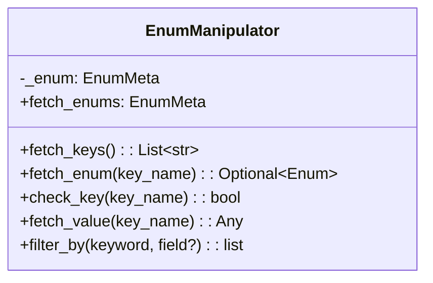

# Module: Tools

## 1. Overview

The Tools module provides small **utility** helpers used across the project: **EnumManipulator** for querying and filtering Python `Enum` members by name/value, and **check_instance_variable** decorator to guard methods when an instance attribute is `None`.

**Roles:**

- **EnumManipulator:** Wrap an `Enum` class; fetch keys, members, values; check key existence; filter keys by keyword (on value or on an attribute of the value).
- **check_instance_variable:** Decorator that returns `None` (or could raise) if a given instance variable is `None` before running the method.

---

## 2. Basics

### Terminology

| Term | Meaning |
|------|--------|
| **EnumManipulator** | Wrapper around an `EnumMeta` (the Enum class). Holds the class; does not hold enum instances. |
| **fetch_keys** | Member names of the Enum (e.g. `["RED", "GREEN"]`). |
| **fetch_enum(key_name)** | Get member by name (case-insensitive). |
| **filter_by(keyword, field?)** | Keys whose member value (or value’s attribute) matches the keyword. |
| **check_instance_variable(variable_name)** | Decorator: if `self.<variable_name>` is None, do not call the method (return None or raise). |

### Entry points

- **Enum helpers:** `from ures.tools import EnumManipulator` → `EnumManipulator(MyEnum)`, then `fetch_keys()`, `fetch_enum("name")`, `filter_by("keyword")`.
- **Guard decorator:** `from ures.tools import check_instance_variable` → `@check_instance_variable("client")` on a method.

---

## 3. Architecture & Logic

- **Core logic:**
  - **EnumManipulator:** Stores `_enum: EnumMeta`. `fetch_keys` uses `_member_names_`. `fetch_enum` iterates keys and compares lowercased. `filter_by` compares keyword to `str(member.value)` or to `getattr(member.value, field, None)` (supports str or list of strings for containment).
  - **check_instance_variable:** Decorator factory. Inner wrapper checks `getattr(self, variable_name) is None`; if True, returns None (code path in repo). If attribute missing, raises `AttributeError`. Logs and swallows `ValueError`/`AttributeError` in the shown path (return None).
- **Dependencies:** Standard library (`enum`, `functools.wraps`, `logging`). No other ures packages.

---

## 4. UML & Structure

### Class diagram



- **check_instance_variable** is a function, not a class: `check_instance_variable(variable_name) -> decorator(method)`.

---

## 5. Code-Level Understanding

### EnumManipulator flow

- **fetch_enum:** Iterates `fetch_keys()`, compares `key_name.lower() == _key.lower()`; returns first match or None.
- **fetch_value:** Uses `fetch_enum(key_name)`; returns `member.value` or None.
- **check_key:** `fetch_enum(key_name) is not None`.
- **filter_by:** For each key, get `member_value = self.fetch_enums[key].value`. If `field is None`, match `keyword == str(member_value)`. Else get `field_value = getattr(member_value, field, None)`; if str, check `keyword.lower() in field_value.lower()`; if list, check keyword in lowercased list. Appends key to result list.

### check_instance_variable flow

1. Decorator is called with `variable_name` (e.g. `"client"`).
2. Wrapped method runs only if `hasattr(self, variable_name)` and `getattr(self, variable_name) is not None`.
3. If attribute is None → return None (current implementation).
4. If attribute does not exist → raise `AttributeError`.
5. Exceptions in the check are logged and wrapper returns None (current implementation).

---

## 6. Usage & Examples

### Integration

```python
from enum import Enum
from ures.tools import EnumManipulator, check_instance_variable
```

### EnumManipulator

```python
class Status(Enum):
    PENDING = "pending"
    DONE = "done"

m = EnumManipulator(Status)
assert m.fetch_keys() == ["PENDING", "DONE"]
assert m.fetch_enum("pending").value == "pending"  # case-insensitive
assert m.filter_by("done") == ["DONE"]
```

### check_instance_variable

```python
class Service:
    def __init__(self):
        self.client = None

    @check_instance_variable("client")
    def call_api(self):
        return self.client.get("/path")
# service.call_api() -> None when client is None
```

---

## 7. Public API / Interfaces

### EnumManipulator

| Method / property | Description |
|-------------------|-------------|
| `fetch_enums` | The Enum class (EnumMeta). |
| `fetch_keys()` | List of member names. |
| `fetch_enum(key_name)` | Member by name (case-insensitive), or None. |
| `check_key(key_name)` | True if member exists. |
| `fetch_value(key_name)` | Value of member, or None. |
| `filter_by(keyword, field=None)` | List of keys whose value (or value’s `field`) matches keyword. |

### check_instance_variable

| Call | Description |
|------|-------------|
| `check_instance_variable(variable_name)` | Returns a decorator. Decorated method runs only if `self.<variable_name>` is not None; else returns None (or raises, if uncommented). Raises AttributeError if attribute missing. |

---

## 8. Maintenance & Troubleshooting

- **filter_by with field:** Assumes `member.value` has the attribute `field`; for list attributes, checks if keyword is in a lowercased string list. Other types are not matched.
- **check_instance_variable:** Current code path returns None when variable is None; the docstring mentions an option to raise. Change the decorator body if you want to raise instead of return None.
- **Tools package exports:** `ures.tools` uses dynamic discovery (pkgutil/importlib) and exports non-underscore classes; adding new modules in the package will expose new symbols.

---

## 9. Execution Protocol

1. **Map logic:** `ures/tools/enum.py` (EnumManipulator), `ures/tools/decorator.py` (check_instance_variable); `ures/tools/__init__.py` discovers and re-exports.
2. **Abstract:** Document purpose and behavior; do not duplicate line-by-line code.
3. **Draft:** Follow this template.
4. **Review:** No sensitive keys or hardcoded paths.
