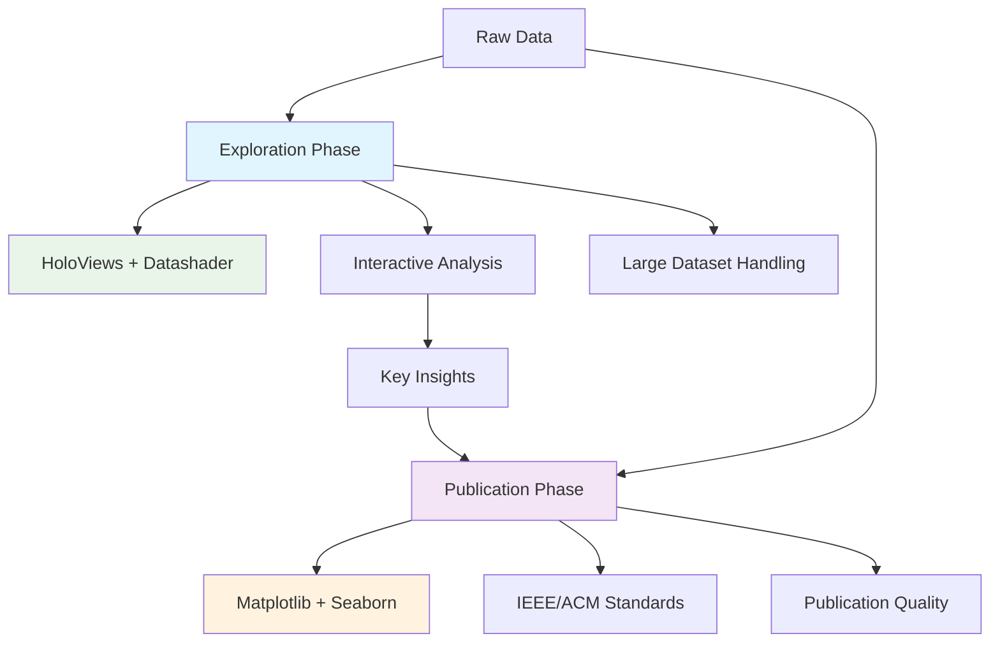

# ML Dual-Track Visualization Workflow

> **A comprehensive visualization library designed for machine learning research with a dual-track approach: fast exploration and publication-ready outputs.**

[](https://python.org)
[](https://pola.rs)
[](LICENSE)
[](#chart-types)

## 🎯 Overview

This library implements a **dual-track visualization workflow** specifically designed for machine learning researchers and data scientists. It provides two complementary approaches:

- **🚀 Exploration Track**: Fast, interactive visualizations for data discovery and hypothesis generation
- **📄 Publication Track**: High-quality, publication-ready figures for academic papers and presentations

## 🏗️ Architecture



## 🔧 Key Features

### ✨ Dual-Track Architecture
- **Seamless mode switching** between exploration and publication
- **Consistent API** across both tracks
- **Automatic optimization** based on data size and usage context

### 📊 Comprehensive Chart Library (21 Types)
- **Basic Statistical Charts**: Line, Scatter, Bar, Histogram, Box, Violin
- **Multi-dimensional Visualization**: Heatmap, Bubble, Radar, Parallel Coordinates
- **Scientific Specialized**: Error bars, Regression, Residual, Q-Q, Density, CDF
- **Multi-subplot Combinations**: Grid layouts, Pair plots, Faceted displays
- **Time Series Analysis**: Decomposition, ACF/PACF

### 🧬 ML-Optimized Features
- **Large dataset handling** with automatic datashading (millions of points)
- **Training curve visualization** with real-time monitoring
- **Hyperparameter optimization** visualization
- **Model comparison** and performance analysis
- **Feature importance** and correlation analysis

### 🎨 Publication-Ready Output
- **IEEE/ACM formatting standards**
- **Colorblind-friendly palettes**
- **Print-compatible designs**
- **Customizable annotations** with existing annotation system
- **High-resolution exports** (300+ DPI)

## 📦 Installation

### Minimum Requirements
```bash
pip install matplotlib polars numpy
```

### Full Installation (Recommended)
```bash
pip install matplotlib polars numpy seaborn holoviews panel datashader bokeh scipy statsmodels pandas
```

### Quick Dependency Check
```python
from research_plot_utils import check_dependencies
check_dependencies()
```

## 🚀 Quick Start

### Basic Dual-Track Workflow

```python
from ml_dual_track_viz import MLVisualizer, MLPlotConfig
import polars as pl
import numpy as np

# Generate sample data
data = pl.DataFrame({
    'epoch': range(100),
    'train_loss': 2.0 * np.exp(-np.arange(100) * 0.05) + np.random.normal(0, 0.1, 100),
    'val_loss': 2.2 * np.exp(-np.arange(100) * 0.04) + np.random.normal(0, 0.15, 100)
})

# 1. EXPLORATION PHASE - Fast iteration
explorer = MLVisualizer(mode="exploration")
config = MLPlotConfig(
    title="Training Progress Exploration",
    xlabel="Epoch",
    ylabel="Loss"
)

# Interactive training curves
interactive_plot = explorer.training_curves(data, config, y_cols=['train_loss', 'val_loss'])

# 2. PUBLICATION PHASE - High quality output
publisher = MLVisualizer(mode="publication")
pub_config = config.for_publication()

# Add scientific annotations
pub_config.annotations.add_text("Convergence", 60, 0.3, fontsize=8, color='red')
pub_config.annotations.add_arrow("Early Stopping", 80, 0.5, 85, 0.7, color='blue')

# Create publication figure
paper_fig = publisher.training_curves(data, pub_config, y_cols=['train_loss', 'val_loss'])
publisher.save_publication_figure(paper_fig, "figure1_training_curves", pub_config)
```

## 📊 Chart Types

### Basic Statistical Charts

| Chart Type | Method | Use Case |
|------------|--------|----------|
| Line Plot | `line_plot()` | Time series, trends |
| Scatter Plot | `scatter_plot()` | Correlations, distributions |
| Bar Plot | `bar_plot()` | Category comparisons |
| Histogram | `histogram()` | Data distributions |
| Box Plot | `box_plot()` | Distribution analysis, outliers |
| Violin Plot | `violin_plot()` | Distribution density |

### Multi-dimensional Visualization

| Chart Type | Method | Use Case |
|------------|--------|----------|
| Heatmap | `heatmap()` | Correlation matrices |
| Bubble Plot | `bubble_plot()` | 3D relationships |
| Radar Chart | `radar_chart()` | Multi-metric comparisons |
| Parallel Coordinates | `parallel_coordinates()` | High-dimensional data |

### Scientific Specialized

| Chart Type | Method | Use Case |
|------------|--------|----------|
| Error Bar Plot | `error_bar_plot()` | Experimental uncertainty |
| Regression Plot | `regression_plot()` | Fitting with confidence intervals |
| Residual Plot | `residual_plot()` | Model diagnostics |
| Q-Q Plot | `qq_plot()` | Distribution testing |
| Density Plot | `density_plot()` | Probability density |
| **CDF Plot** | `cdf_plot()` | **Cumulative distribution** |

### Multi-subplot Combinations

| Chart Type | Method | Use Case |
|------------|--------|----------|
| Subplot Grid | `subplots_grid()` | Multiple related charts |
| Pair Plot | `pair_plot()` | Pairwise relationships |
| Facet Grid | `facet_grid()` | Category-grouped displays |

### Time Series Specialized

| Chart Type | Method | Use Case |
|------------|--------|----------|
| Decomposition | `time_series_decomposition()` | Trend, seasonality, residual |
| ACF/PACF | `acf_pacf_plot()` | Time series analysis |

## 🔬 ML-Specific Workflows

### Training Analysis

```python
# Real-time training monitoring
explorer = MLVisualizer(mode="exploration")
training_plot = explorer.training_curves(
    training_logs,
    config,
    y_cols=['train_loss', 'val_loss', 'train_acc', 'val_acc']
)

# Publication-ready training curves
publisher = MLVisualizer(mode="publication")
paper_fig = publisher.training_curves(training_logs, pub_config, y_cols=['train_loss', 'val_loss'])
```

### Large Dataset Exploration

```python
# Automatic datashading for millions of points
large_scatter = explorer.large_scatter(
    million_point_dataset,
    config,
    'feature1', 'feature2',
    color_col='cluster'
)
```

### Hyperparameter Optimization

```python
# Interactive parameter space exploration
hyperparam_heatmap = explorer.hyperparameter_heatmap(
    optimization_results,
    config,
    'learning_rate', 'batch_size', 'accuracy'
)

# Publication hyperparameter analysis
pub_heatmap = publisher.hyperparameter_heatmap(
    optimization_results,
    pub_config,
    'learning_rate', 'batch_size', 'accuracy'
)
```

### Model Comparison

```python
# Quick model performance comparison
model_comparison = explorer.model_comparison(
    results_df, config, 'model', 'accuracy', 'std_error'
)

# Publication-ready comparison
pub_comparison = publisher.model_comparison(
    results_df, pub_config, 'model', 'accuracy', 'std_error'
)
```

## 📈 Advanced Features

### Automatic Large Data Optimization

```python
# Automatically applies datashading for datasets > 50k points
config = MLPlotConfig(
    datashade_large_data=True,
    large_data_threshold=50000
)

# Handles millions of points efficiently
massive_scatter = explorer.large_scatter(
    massive_dataset, config, 'x', 'y', color_col='category'
)
```

### Publication Mode Conversion

```python
# One-line conversion to publication settings
pub_config = exploration_config.for_publication()

# Automatically adjusts:
# - Figure sizes to IEEE standards
# - DPI to 300+ for print quality
# - Colors to colorblind-friendly
# - Fonts to publication specifications
```

### Scientific Annotations

```python
# Reuses existing annotation system
config.annotations.add_text("Significance", x=5, y=0.95, fontsize=8, color='red')
config.annotations.add_arrow("Outlier", x=7, y=0.1, arrow_x=7.5, arrow_y=0.05)

# Annotations work across both exploration and publication modes
```

## 🎨 Styling and Customization

### Paper-Ready Styling

```python
# IEEE/ACM standard configurations
paper_style = PaperStyleConfig(
    single_column_width=3.5,  # inches
    double_column_width=7.0,  # inches
    font_family="Arial",
    base_font_size=8,
    colors=["colorblind_friendly_palette"]
)
```

### Flexible Color Schemes

```python
# Predefined scientific color schemes
config.color_config = ColorConfig(scheme=ColorScheme.SCIENTIFIC)
config.color_config = ColorConfig(scheme=ColorScheme.NATURE)
config.color_config = ColorConfig(scheme=ColorScheme.COLORBLIND_FRIENDLY)

# Custom color schemes
config.color_config = ColorConfig(
    scheme=ColorScheme.CUSTOM,
    custom_colors=['#FF6B6B', '#4ECDC4', '#45B7D1']
)
```

## 📊 Real-World Examples

### Complete ML Pipeline Visualization

```python
class MLExperimentVisualizer:
    def __init__(self):
        self.explorer = MLVisualizer(mode="exploration")
        self.publisher = MLVisualizer(mode="publication")

    def analyze_experiment(self, experiment_data):
        # 1. Quick exploration
        self.explore_data_distribution(experiment_data)
        self.explore_training_dynamics(experiment_data)
        self.explore_hyperparameter_space(experiment_data)

        # 2. Publication figures
        self.create_main_results_figure(experiment_data)
        self.create_supplementary_figures(experiment_data)

    def explore_data_distribution(self, data):
        """Fast data quality assessment"""
        config = MLPlotConfig(title="Data Distribution Analysis")

        # Multi-panel exploration
        plots = [
            self.explorer.histogram(data, config, 'target'),
            self.explorer.box_plot(data, config, 'feature', 'category'),
            self.explorer.pair_plot(data, config, ['feat1', 'feat2', 'feat3'])
        ]
        return plots

    def create_main_results_figure(self, data):
        """Publication-ready main results"""
        pub_config = MLPlotConfig(
            title="Experimental Results",
            mode="publication",
            figsize=(7.0, 3.0)  # Double column
        )

        # Add statistical significance annotations
        pub_config.annotations.add_text("p < 0.001", 2, 0.95, fontsize=8)

        # Create publication figure
        fig = self.publisher.model_comparison(
            data, pub_config, 'method', 'performance', 'std_error'
        )

        self.publisher.save_publication_figure(fig, "main_results", pub_config)
        return fig
```

### Time Series Analysis Workflow

```python
def analyze_time_series(ts_data):
    """Complete time series analysis workflow"""

    # 1. Exploration: Quick overview
    explorer = MLVisualizer(mode="exploration")
    config = MLPlotConfig(title="Time Series Exploration")

    # Interactive exploration
    overview = explorer.line_plot(ts_data, config, 'date', 'value')

    # 2. Deep dive: Statistical analysis
    decomposition = explorer.time_series_decomposition(
        ts_data, config, 'date', 'value'
    )

    autocorr = explorer.acf_pacf_plot(ts_data, config, 'value')

    # 3. Publication: Statistical summary
    publisher = MLVisualizer(mode="publication")
    pub_config = config.for_publication()

    # Publication-ready decomposition
    pub_decomposition = publisher.time_series_decomposition(
        ts_data, pub_config, 'date', 'value'
    )

    publisher.save_publication_figure(
        pub_decomposition, "time_series_analysis", pub_config
    )

    return {
        'exploration': [overview, decomposition, autocorr],
        'publication': [pub_decomposition]
    }
```

## 🔧 Integration with Existing Systems

### Weights & Biases Integration

```python
def integrate_with_wandb(wandb_run):
    """Example W&B integration"""
    # Get training logs from W&B
    training_history = wandb_run.history()

    # Convert to Polars DataFrame
    df = pl.DataFrame(training_history)

    # Use dual-track workflow
    explorer = MLVisualizer(mode="exploration")
    config = MLPlotConfig(title="W&B Training Analysis")

    # Quick exploration
    training_curves = explorer.training_curves(
        df, config, y_cols=['train_loss', 'val_loss']
    )

    # Log back to W&B
    wandb.log({"training_curves": wandb.Image(training_curves)})
```

### MLflow Integration

```python
def integrate_with_mlflow(experiment_id):
    """Example MLflow integration"""
    client = mlflow.tracking.MlflowClient()
    runs = client.search_runs(experiment_ids=[experiment_id])

    # Convert runs to comparison data
    comparison_data = pl.DataFrame([
        {
            'model': run.data.tags.get('model_name', 'unknown'),
            'accuracy': run.data.metrics.get('accuracy', 0),
            'std_error': run.data.metrics.get('accuracy_std', 0.01)
        }
        for run in runs
    ])

    # Create publication comparison
    publisher = MLVisualizer(mode="publication")
    config = MLPlotConfig(title="MLflow Experiment Comparison")

    comparison_fig = publisher.model_comparison(
        comparison_data, config, 'model', 'accuracy', 'std_error'
    )

    return comparison_fig
```

## 📚 Best Practices

### Workflow Recommendations

1. **Start with Exploration**
   ```python
   # Always begin with fast, interactive exploration
   explorer = MLVisualizer(mode="exploration")
   # Iterate quickly, discover patterns
   ```

2. **Identify Key Insights**
   ```python
   # Use exploration to find what's worth publishing
   # Focus on statistically significant findings
   ```

3. **Create Publication Figures**
   ```python
   # Switch to publication mode for final figures
   publisher = MLVisualizer(mode="publication")
   pub_config = config.for_publication()
   ```

4. **Add Scientific Context**
   ```python
   # Always add meaningful annotations
   pub_config.annotations.add_text("Statistical significance", x, y)
   ```

### Performance Optimization

```python
# For large datasets (>100k points)
config = MLPlotConfig(
    datashade_large_data=True,
    large_data_threshold=50000
)

# For publication, sample large datasets
if len(df) > 10000:
    df_sampled = df.sample(n=10000, seed=42)
```

### Memory Management

```python
# Always close matplotlib figures
import matplotlib.pyplot as plt

fig = publisher.line_plot(data, config, 'x', 'y')
publisher.save_publication_figure(fig, "output", config)
plt.close(fig)  # Important for memory management
```

## 🚀 Advanced Usage

### Custom Chart Types

```python
class CustomMLVisualizer(CompleteMLVisualizer):
    """Extend with custom chart types"""

    def confusion_matrix_heatmap(self, y_true, y_pred, config):
        """Custom confusion matrix visualization"""
        from sklearn.metrics import confusion_matrix

        cm = confusion_matrix(y_true, y_pred)
        cm_df = pl.DataFrame(cm)

        return self.heatmap(cm_df, config, annot=True, fmt='d')

    def roc_comparison(self, roc_data, config):
        """Custom ROC curve comparison"""
        self.backend._setup_figure(config)

        for model_name, (fpr, tpr, auc_score) in roc_data.items():
            self.backend.ax.plot(fpr, tpr,
                               label=f'{model_name} (AUC = {auc_score:.3f})')

        # Add diagonal reference line
        self.backend.ax.plot([0, 1], [0, 1], 'k--', alpha=0.5)

        self.backend.ax.set_xlabel('False Positive Rate')
        self.backend.ax.set_ylabel('True Positive Rate')
        self.backend.ax.legend()
        self.backend.ax.grid(True, alpha=0.3)

        return self.backend.fig
```

### Batch Processing

```python
def batch_create_figures(experiments, output_dir):
    """Create publication figures for multiple experiments"""
    publisher = MLVisualizer(mode="publication")

    for exp_name, exp_data in experiments.items():
        config = MLPlotConfig(
            title=f"Experiment: {exp_name}",
            mode="publication"
        )

        # Training curves
        training_fig = publisher.training_curves(
            exp_data['training'], config, y_cols=['loss', 'accuracy']
        )

        # Model comparison
        comparison_fig = publisher.model_comparison(
            exp_data['results'], config, 'model', 'performance', 'std_error'
        )

        # Save with organized naming
        publisher.save_publication_figure(
            training_fig, f"{output_dir}/{exp_name}_training", config
        )
        publisher.save_publication_figure(
            comparison_fig, f"{output_dir}/{exp_name}_comparison", config
        )

        # Cleanup
        plt.close(training_fig)
        plt.close(comparison_fig)
```

## 🔍 Troubleshooting

### Common Issues

**Issue**: "HoloViews not available" warning
```bash
# Solution: Install exploration dependencies
pip install holoviews panel datashader bokeh
```

**Issue**: "Seaborn not available" warning
```bash
# Solution: Install styling dependencies
pip install seaborn
```

**Issue**: Figures not saving properly
```python
# Solution: Check file permissions and format
publisher.save_publication_figure(fig, "output.pdf", config)
# Ensure .pdf extension is included
```

**Issue**: Large datasets causing memory issues
```python
# Solution: Enable datashading or sample data
config.datashade_large_data = True
# Or sample large datasets for publication
df_sampled = df.sample(n=10000, seed=42)
```

### Performance Tips

1. **Use appropriate mode for task**
   - Exploration mode for data discovery
   - Publication mode for final figures

2. **Manage memory with large datasets**
   - Enable datashading for >50k points
   - Sample data for publication figures
   - Always close matplotlib figures

3. **Optimize figure creation**
   - Reuse visualizer instances
   - Batch process multiple figures
   - Use appropriate figure sizes

## 📄 License

MIT License - see [LICENSE](LICENSE) file for details.

## 🤝 Contributing

We welcome contributions! Please see [CONTRIBUTING.md](CONTRIBUTING.md) for guidelines.

### Development Setup

```bash
git clone https://github.com/your-repo/ml-dual-track-viz.git
cd ml-dual-track-viz
pip install -e .[dev]
pytest tests/
```

## 📚 Citation

If you use this library in your research, please cite:

```bibtex
@software{ml_dual_track_viz,
  title={ML Dual-Track Visualization Workflow},
  author={Your Name},
  year={2024},
  url={https://github.com/your-repo/ml-dual-track-viz}
}
```

## 🔗 Related Projects

- [Polars](https://pola.rs/) - Lightning-fast DataFrame library
- [HoloViews](http://holoviews.org/) - Declarative data visualization
- [Matplotlib](https://matplotlib.org/) - Publication-quality plotting
- [Seaborn](https://seaborn.pydata.org/) - Statistical data visualization

---

**Built with ❤️ for the ML research community**
